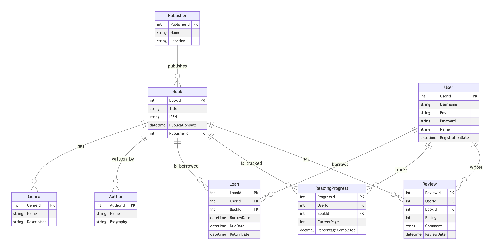

# Smart Book Project

## Description

The Smart Book project aims to be an application for managing and interacting with books. While the specific features are still being defined, the initial focus is on creating a robust database structure to support core functionalities like Browse books, managing user information, and potentially features like borrowing, tracking reading progress, and reviews.

## Table of Contents

- [Prerequisites](#prerequisites)
- [Setup Instructions](#setup-instructions)
  - [Database Setup](#database-setup)
  - [API Setup](#api-setup)
- [Project Structure](#project-structure)
- [Technologies Used](#technologies-used)
- [Getting Started (Development)](#getting-started-development)
- [Entity-Relationship Diagram (ERD)](#entity-relationship-diagram-erd)
- [Contributing](#contributing)
- [License](#license)
- [Contact](#contact)

## Prerequisites

Before you can run the Smart Book project, you will need the following installed on your system:

- **[.NET SDK](https://dotnet.microsoft.com/download)**: Ensure you have the latest compatible .NET SDK installed.
- **[SQL Server](https://www.microsoft.com/sql-server/sql-server-downloads)**: You will need a running instance of SQL Server (e.g., SQL Server Express, Developer Edition, or a cloud-based instance).
- **[SQL Server Management Studio (SSMS)](https://learn.microsoft.com/sql-server/ssms/download-ssms-sql-server)** (Optional, but recommended for database management).

## Setup Instructions

Follow these steps to set up the Smart Book project on your local machine.

### Database Setup

1.  **Create the Database:**

    - Open SQL Server Management Studio (SSMS) or your preferred SQL Server management tool.
    - Connect to your SQL Server instance.
    - Create a new database named `SmartBookDb`.

2.  **Configure Connection String:**

    - Navigate to the `SmartBook.Api` directory in your project.
    - Open the `appsettings.json` file.
    - Update the `ConnectionStrings:DefaultConnection` section with your SQL Server connection details. Replace the placeholders with your actual server name, database name, username (if using SQL Server Authentication), and password.

      ```json
      {
        "ConnectionStrings": {
          "DefaultConnection": "Server=YOUR_SERVER_NAME;Database=SmartBookDb;User Id=YOUR_USER_ID;Password=YOUR_PASSWORD;TrustServerCertificate=True;"
        }
        // ... other settings
      }
      ```

      **Note:** If you are using Windows Authentication, your connection string might look like this:

      ```json
      {
        "ConnectionStrings": {
          "DefaultConnection": "Server=YOUR_SERVER_NAME;Database=SmartBookDb;Integrated Security=True;TrustServerCertificate=True;"
        }
        // ... other settings
      }
      ```

3.  **Apply Migrations:**
    - Open your terminal or command prompt.
    - Navigate to the `SmartBook.Database` directory:
      ```bash
      cd path/to/SmartBook/SmartBook.Database
      ```
    - Run the following command to apply the database migrations:
      ```bash
      dotnet ef database update --startup-project ../SmartBook.Api
      ```
      This command will create the database schema based on your Entity Framework Core models and migrations.

### API Setup

1.  **Navigate to the API Directory:**

    - In your terminal or command prompt, navigate to the `SmartBook.Api` directory:
      ```bash
      cd path/to/SmartBook/SmartBook.Api
      ```

2.  **Run the API:**
    - Execute the following command to build and run the API:
      ```bash
      dotnet run
      ```
    - The API should now be running, and you can access its endpoints (if any are currently implemented).

## Project Structure

The solution is typically structured into the following projects:

- **SmartBook.Api:** Contains the ASP.NET Core Web API project, responsible for handling HTTP requests and responses. This project also manages the application's configuration and startup.
- **SmartBook.Database:** Contains the Entity Framework Core context, database models, and migrations. This project is responsible for interacting with the database.

## Technologies Used

- **[.NET](https://dotnet.microsoft.com/)**: The primary development platform.
- **[ASP.NET Core](https://dotnet.microsoft.com/apps/aspnet)**: Framework for building web applications and APIs.
- **[Entity Framework Core (EF Core)](https://learn.microsoft.com/ef/core/)**: An object-relational mapper (ORM) for interacting with the database.
- **[Microsoft.Data.SqlClient](https://www.nuget.org/packages/Microsoft.Data.SqlClient)**: The ADO.NET provider for SQL Server.

## Getting Started (Development)

- Open the solution file (`SmartBook.sln`) in Visual Studio or your preferred .NET IDE.
- You can add new features, modify existing ones, and create additional database models and migrations as needed.
- Remember to run `dotnet ef migrations add YourMigrationName --startup-project ../SmartBook.Api` in the `SmartBook.Database` directory to create new migrations after modifying your models.
- Use `dotnet ef database update --startup-project ../SmartBook.Api` to apply new migrations to the database.

## Entity-Relationship Diagram (ERD)


